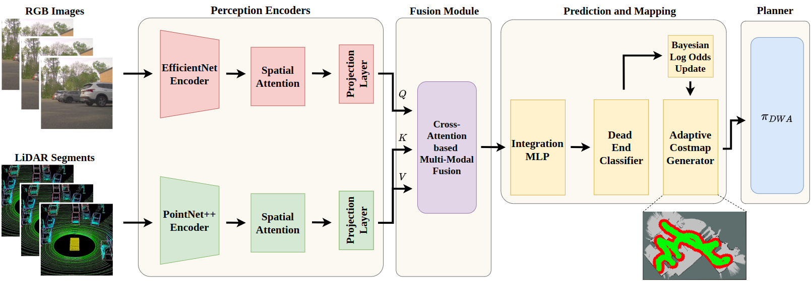

# DR.Nav — Dead-End Risk-Aware Navigation

**DR.Nav** is a ROS 2 navigation system that uses RGB-LiDAR sensor fusion and a deep learning model to predict dead ends proactively and recover from them autonomously. The system operates in both mapless (exploration) and map-based (structured) environments.



---

## Table of Contents

1. [System Overview](#1-system-overview)
2. [Architecture: DR.Nav Method](#2-architecture-drnav-method)
   - [Full Pipeline Flowchart](#full-pipeline-flowchart)
   - [Model Inference Flowchart](#model-inference-flowchart)
   - [Risk Mapping and Recovery Flowchart](#risk-mapping-and-recovery-flowchart)
   - [Goal Generation Flowchart](#goal-generation-flowchart)
3. [Node Reference](#3-node-reference)
4. [ROS 2 Topic Map](#4-ros-2-topic-map)
5. [Hardware Requirements](#5-hardware-requirements)
6. [Software Requirements](#6-software-requirements)
7. [Installation](#7-installation)
   - [Option A — Native Install](#option-a--native-install)
   - [Option B — Docker (Recommended for deployment)](#option-b--docker-recommended-for-deployment)
8. [Path Configuration — Required Before First Run](#8-path-configuration--required-before-first-run)
9. [Running on a Real Robot](#9-running-on-a-real-robot)
   - [Mapless Mode](#91-mapless-mode)
   - [Map-Based Mode](#92-map-based-mode)
10. [Running in Docker](#10-running-in-docker)
11. [Isaac Sim Setup](#11-isaac-sim-setup)
12. [Launch File Arguments](#12-launch-file-arguments)
13. [RViz Visualization Topics](#13-rviz-visualization-topics)
14. [Key Parameters](#14-key-parameters)
15. [Package Structure](#15-package-structure)
16. [Known Issues and Fixes](#16-known-issues-and-fixes)

---

## 1. System Overview

DR.Nav consists of four sequential processing stages that run in parallel as independent ROS 2 nodes:

```
[Sensors]  →  [Inference]  →  [Risk Mapping]  →  [Goal Generation]  →  [Planner]  →  [Robot]
```

| Stage | Node | Role |
|---|---|---|
| Sensor preprocessing | `pointcloud_segmenter` | Splits omnidirectional LiDAR into directional sectors |
| Dead-end inference | `infer_vis` | Runs the DRaM model; outputs path probabilities per direction |
| Risk mapping | `dram_risk_map` | Builds a Bayesian safety grid; tracks recovery waypoints |
| Goal generation | `goal_generator` | Scores candidate headings; sends waypoints to the planner |
| Local planning | `dwa_planner` | Executes velocity commands toward the current waypoint |

The system uses a unified scoring formula across all methods:

```
Score(θ) = J_geom(θ) + λ · EDE(θ)
```

- **J_geom**: Geometric cost — collision avoidance, feasibility, smoothness, range bias
- **EDE**: Exposure to Dead-End — accumulated dead-end risk integral along heading θ
- **λ**: Weighting coefficient — `λ = 1.0` for DR.Nav, `λ = 0.0` for all baselines

---

## 2. Architecture: DR.Nav Method

### Full Pipeline Flowchart

```
┌─────────────────────────────────────────────────────────────────────────────┐
│                          HARDWARE SENSORS                                   │
│                                                                             │
│  ┌─────────────┐  ┌─────────────┐  ┌─────────────┐  ┌──────────────────┐  │
│  │  Camera     │  │  Camera     │  │  Camera     │  │  Ouster LiDAR    │  │
│  │  Front-Left │  │  Side-Left  │  │  Side-Right │  │  (Omnidirectional│  │
│  │  (AR0234)   │  │  (AR0234)   │  │  (AR0234)   │  │   Full Scan)     │  │
│  └──────┬──────┘  └──────┬──────┘  └──────┬──────┘  └────────┬─────────┘  │
│         │                │                │                   │            │
└─────────┼────────────────┼────────────────┼───────────────────┼────────────┘
          │                │                │                   │
          │ /argus/ar0234_front_left/image_raw                  │ /os_cloud_node/points
          │ /argus/ar0234_side_left/image_raw                   │
          │ /argus/ar0234_side_right/image_raw                  │
          │                │                │                   ▼
          │                │                │        ┌──────────────────────┐
          │                │                │        │  pointcloud_segmenter│
          │                │                │        │  (Sector Splitter)   │
          │                │                │        └──────────┬───────────┘
          │                │                │                   │
          │                │                │    ┌──────────────┼──────────────┐
          │                │                │    │              │              │
          │                │                │  /lidar/    /lidar/        /lidar/
          │                │                │  front/     left/          right/
          │                │                │  points     points         points
          │                │                │    │              │              │
          ▼                ▼                ▼    ▼              ▼              ▼
          └────────────────┴────────────────┴────┴──────────────┴──────────────┘
                                            │
                              ┌─────────────▼──────────────┐
                              │        infer_vis            │
                              │  (DRaM Model Inference)     │
                              │                             │
                              │  Input:                     │
                              │   3× RGB image (224×224)    │
                              │   3× PointCloud (1024 pts)  │
                              │                             │
                              │  Output:                    │
                              │   path_status  [3×float]    │
                              │   is_dead_end  [bool]       │
                              └─────────┬───────────────────┘
                                        │
               /dead_end_detection/path_status  [front, left, right] ∈ [0,1]
               /dead_end_detection/is_dead_end  [true/false]
                                        │
                              ┌─────────▼───────────────────┐
                              │       dram_risk_map          │
                              │  (Bayesian Risk Grid +       │
                              │   Recovery Point Manager)    │
                              │                             │
                              │  Inputs:                    │
                              │   path_status               │
                              │   /map (OccupancyGrid)      │
                              │   TF: map → body            │
                              │                             │
                              │  Outputs:                   │
                              │   dram_exploration_map      │
                              │   recovery_points           │
                              │   cost_layer (RViz only)    │
                              └─────────┬───────────────────┘
                                        │
               /dram_exploration_map  (MarkerArray — EDE heatmap)
               /dead_end_detection/recovery_points  (Float32MultiArray)
                                        │
                              ┌─────────▼───────────────────┐
                              │      goal_generator          │
                              │  (Unified Scoring + Waypoint │
                              │   Selection)                 │
                              │                             │
                              │  Score(θ) = J_geom + λ·EDE  │
                              │  λ = 1.0  (DR.Nav)          │
                              │  36 rays × [-π, π]          │
                              │                             │
                              │  Recovery mode:             │
                              │   triggered if stuck > 5s   │
                              │   navigates to best stored  │
                              │   recovery point            │
                              └─────────┬───────────────────┘
                                        │
                              /move_base_simple/goal  (PoseStamped)
                                        │
                              ┌─────────▼───────────────────┐
                              │        dwa_planner           │
                              │  (Dynamic Window Approach)   │
                              │                             │
                              │  Inputs:  goal, /map, TF    │
                              │  Output: /cmd_vel            │
                              └─────────────────────────────┘
```

---

### Model Inference Flowchart

```
                    ┌────────────────────────────────────────┐
                    │          infer_vis Node                │
                    │     (dead_end_detection_visual_node)   │
                    └────────────────────────────────────────┘

  ┌──────────────┐      ┌────────────────────────────────────────────────────┐
  │  Camera      │      │  PREPROCESSING                                     │
  │  Callbacks   │      │                                                    │
  │  (3× Image)  │─────▶│  Resize to 224×224                                 │
  └──────────────┘      │  Normalize: mean=[0.485,0.456,0.406]               │
                        │             std=[0.229,0.224,0.225]                │
  ┌──────────────┐      │  Stack → image_tensors [3, 3, 224, 224]            │
  │  LiDAR       │      │                                                    │
  │  Callbacks   │      │  Point cloud: sample 1024 pts (robot_mode=True)    │
  │  (3× PC2)    │─────▶│  Fields parsed from message header (any format)   │
  └──────────────┘      │  Stack → lidar_tensors [3, 3, 1024]                │
                        └───────────────────┬────────────────────────────────┘
                                            │
                                            │  (batched every 1/5 s in robot_mode)
                                            ▼
                        ┌───────────────────────────────────────────────────────┐
                        │           DeadEndDetectionModel (model_CA.py)         │
                        │                                                       │
                        │   Input branches:                                     │
                        │   ┌─────────────┐    ┌────────────────────────────┐  │
                        │   │ Image branch│    │ LiDAR branch               │  │
                        │   │ (CNN embed) │    │ (PointNet-style embed)     │  │
                        │   └──────┬──────┘    └─────────────┬──────────────┘  │
                        │          └──────────┬───────────────┘                │
                        │                     ▼                                │
                        │           Cross-Attention Fusion                     │
                        │                     ▼                                │
                        │           Shared Trunk (MLP)                        │
                        │                     ▼                                │
                        │   ┌─────────────────┴─────────────────┐             │
                        │   │  path_status head                 │             │
                        │   │  (3 logits → sigmoid → probs)     │             │
                        │   │  [front_prob, left_prob,          │             │
                        │   │   right_prob]  ∈ [0, 1]           │             │
                        │   └───────────────────────────────────┘             │
                        └───────────────────────────────────────────────────┘
                                            │
                                            ▼
                        ┌───────────────────────────────────────────────────────┐
                        │            DECISION LOGIC                             │
                        │                                                       │
                        │   threshold = 0.56                                   │
                        │                                                       │
                        │   for each direction d ∈ {front, left, right}:       │
                        │       open[d] = (prob[d] > 0.56)                     │
                        │                                                       │
                        │   is_dead_end = (open[front] == open[left]            │
                        │                  == open[right] == False)             │
                        └───────────────────┬───────────────────────────────────┘
                                            │
                    ┌───────────────────────┴────────────────────────┐
                    │                                                │
                    ▼                                                ▼
     /dead_end_detection/path_status               /dead_end_detection/is_dead_end
     Float32MultiArray                             std_msgs/Bool
     [front_prob, left_prob, right_prob]           true  if all 3 blocked
     published at ~5 Hz                            false otherwise
```

---

### Risk Mapping and Recovery Flowchart

```
                   ┌────────────────────────────────────────────┐
                   │           dram_risk_map Node               │
                   └────────────────────────────────────────────┘

  /dead_end_detection/path_status ──────────────────────────────┐
  /map  (OccupancyGrid)  ────────────────────────────────────┐  │
  TF: map → body  ────────────────────────────────────────┐  │  │
                                                          │  │  │
                                                          ▼  ▼  ▼
                              ┌───────────────────────────────────────┐
                              │  path_status_callback()               │
                              │                                       │
                              │  1. TF lookup: robot_x, robot_y, yaw  │
                              │  2. Decode probs [front, left, right] │
                              │  3. Classify: open if prob > 0.56     │
                              └──────────────┬────────────────────────┘
                                             │
               ┌─────────────────────────────┼────────────────────────────────┐
               │                             │                                │
               ▼                             ▼                                ▼
  ┌────────────────────────┐   ┌──────────────────────────┐   ┌────────────────────────┐
  │  RecoveryPointManager  │   │  Bayesian Safety Grid    │   │  Sector Visualisation  │
  │                        │   │                          │   │                        │
  │  If any direction open:│   │  For each cell within    │   │  3 triangle sectors    │
  │  store (x, y, rank)    │   │  3.0 m of robot:         │   │  front / left / right  │
  │                        │   │  safety_level:           │   │  green  = open         │
  │  rank = # open dirs    │   │   1.0 if any open        │   │  red    = blocked      │
  │  (1 = tight, 3 = free) │   │   0.0 if dead end        │   │  alpha  = 0.6          │
  │                        │   │                          │   │                        │
  │  Deduplication:        │   │  weight by distance:     │   │  Historical fade:      │
  │  within 1.0 m keep     │   │  w = 1 - dist/radius     │   │  past sectors shown    │
  │  highest rank only     │   │                          │   │  at alpha = 0.25       │
  │                        │   │  Navigability check:     │   │  for 20 s              │
  │  Expiry: 60 s          │   │  skip cells with         │   └────────────┬───────────┘
  │  Capacity: 50 points   │   │  occupancy > 0           │                │
  └────────────┬───────────┘   └──────────────┬───────────┘                │
               │                              │                             │
               ▼                              ▼                             ▼
  /dead_end_detection/recovery_points   /dram_exploration_map         /cost_layer
  Float32MultiArray                     MarkerArray                   MarkerArray
  [type, x, y, type, x, y, ...]        ns="exploration_heatmap"      (RViz debug)
  type 1.0 = rank ≥ 2 (preferred)      green = safe  (safety ≥ 0.5)
  type 2.0 = rank = 1  (fallback)      red   = risky (safety < 0.5)
```

---

### Goal Generation Flowchart

```
                    ┌───────────────────────────────────────┐
                    │        goal_generator Node            │
                    │     method_type = multi_camera_dram   │
                    │     lambda_ede  = 1.0                 │
                    │     rate        = 7.0 Hz              │
                    │     horizon     = 4.0 m               │
                    └───────────────────────────────────────┘

  Inputs:
  ┌─────────────────────────────────────────────────────────────────────────┐
  │  /dram_exploration_map      — Bayesian risk grid (from dram_risk_map)   │
  │  /dead_end_detection/is_dead_end   — current blocked status             │
  │  /dead_end_detection/path_status   — per-direction probabilities        │
  │  /dead_end_detection/recovery_points — stored safe waypoints            │
  │  /map                       — OccupancyGrid                             │
  │  TF: map → base_link                                                    │
  └─────────────────────────────────────────────────────────────────────────┘

  ┌─────────────────────────────────────────────────────────────────────────┐
  │                     NORMAL NAVIGATION MODE                              │
  │                                                                         │
  │  Sample 36 headings θ uniformly over [-π, π]  (10° spacing)            │
  │                                                                         │
  │  For each heading θ:                                                    │
  │  ┌───────────────────────────────────────────────────────────────────┐  │
  │  │  Cast ray at θ for horizon_distance = 4.0 m                      │  │
  │  │  step = 0.15 m                                                   │  │
  │  │                                                                  │  │
  │  │  J_geom(θ):                                                      │  │
  │  │    collision_cost   = Σ inflated_costmap(step)  × 50.0           │  │
  │  │    feasibility_cost = 1000.0  if ray hits obstacle               │  │
  │  │    smoothness_cost  = Δyaw × 0.5                                 │  │
  │  │    range_bias_cost  = (horizon - actual_length) × 0.1            │  │
  │  │                                                                  │  │
  │  │  EDE(θ):  (DR.Nav only, λ = 1.0)                                │  │
  │  │    EDE = Σᵢ risk_prob[i] × Δs                                   │  │
  │  │    bilinear sample of explored_grid at each step i              │  │
  │  │                                                                  │  │
  │  │  Score(θ) = J_geom(θ) + 1.0 × EDE(θ)                          │  │
  │  └───────────────────────────────────────────────────────────────┘  │
  │                                                                         │
  │  Select θ* = argmin Score(θ)                                           │
  │  Waypoint = robot_pos + horizon × [cos(θ*), sin(θ*)]                  │
  │  Publish  /move_base_simple/goal                                        │
  └─────────────────────────────────────────────────────────────────────────┘

                              │
               ┌──────────────┴──────────────┐
               │                             │
     is_dead_end = True          robot_displacement < 0.1 m
     (all dirs blocked)          for > 5 consecutive seconds
               └──────────────┬──────────────┘
                               │
                               ▼
  ┌─────────────────────────────────────────────────────────────────────────┐
  │                        RECOVERY MODE                                    │
  │                                                                         │
  │  Query RecoveryPointManager for best stored recovery point:             │
  │    get_best_recovery_point()  → highest rank (most open directions)     │
  │    get_nearest_recovery_point() → fallback if no best                   │
  │                                                                         │
  │  Score each recovery candidate:                                         │
  │    recovery_score = α × goal_progress                                   │
  │                   + β × clearance                                       │
  │                   - γ × roughness                                       │
  │                   - δ × ede_from_recovery_point                         │
  │                                                                         │
  │    α = 1.0, β = 2.0, γ = 0.5, δ = 0.3                                 │
  │                                                                         │
  │  Publish recovery waypoint → robot backtracks to safe position          │
  └─────────────────────────────────────────────────────────────────────────┘
```

---

## 3. Node Reference

### `pointcloud_segmenter`

Splits the full Ouster LiDAR scan into three directional sectors using azimuth angle.

| | |
|---|---|
| **Subscribes** | `/os_cloud_node/points` — full LiDAR scan |
| **Publishes** | `/lidar/front/points`, `/lidar/left/points`, `/lidar/right/points` |
| **Sector angles** | Front: −30° to +30° / Left: +60° to +120° / Right: −120° to −60° |

---

### `infer_vis`

Runs the DRaM deep learning model (RGB + LiDAR fusion) and publishes per-direction path probabilities.

| | |
|---|---|
| **Subscribes** | 3× camera image topics, 3× directional LiDAR point clouds |
| **Publishes** | `/dead_end_detection/path_status` (Float32MultiArray), `/dead_end_detection/is_dead_end` (Bool) |
| **Model input** | 3× image tensors (224×224) + 3× point clouds (1024 points each) |
| **Model output** | Sigmoid probabilities per direction — threshold 0.56 |
| **Processing rate** | 5 Hz (robot mode), 10 Hz (rosbag mode) |
| **Executor** | MultiThreadedExecutor, 4 threads |
| **Point cloud parsing** | Pure numpy — reads field offsets from message header, works with any LiDAR format |
| **Camera QoS** | RELIABLE (robot mode) — matches Isaac Sim and real camera drivers |
| **LiDAR QoS** | BEST_EFFORT (robot mode) — matches real robot drivers and Isaac Sim |

---

### `dram_risk_map`

Merges Bayesian risk grid construction and recovery point tracking into a single node.

| | |
|---|---|
| **Subscribes** | `/dead_end_detection/path_status`, `/map` |
| **Publishes** | `/dram_exploration_map` (risk heatmap), `/dead_end_detection/recovery_points`, `/cost_layer` (RViz) |
| **Grid resolution** | 0.3 m per cell |
| **Exploration radius** | 3.0 m around robot |
| **Threshold** | 0.56 (consistent with infer_vis) |

---

### `goal_generator`

Scores 36 candidate headings using the unified DR.Nav formula and publishes waypoints at 7 Hz.

| | |
|---|---|
| **Subscribes** | `/dram_exploration_map`, `/dead_end_detection/recovery_points`, `/dead_end_detection/is_dead_end`, `/dead_end_detection/path_status`, `/map` |
| **Publishes** | `/move_base_simple/goal` (PoseStamped), `/goal_generator/waypoints`, `/goal_generator/rays` (visualization) |
| **Parameters** | `method_type=multi_camera_dram`, `lambda_ede=1.0`, `goal_generation_rate=7.0`, `horizon_distance=4.0` |

---

### `dwa_planner`

Executes velocity commands toward the current waypoint using the Dynamic Window Approach.

| | |
|---|---|
| **Subscribes** | `/move_base_simple/goal`, `/map` |
| **Publishes** | `/cmd_vel` (Twist) |
| **TF lookup** | `map` → `base_link` |
| **Control rate** | 10 Hz |

---

### `odom_tf_broadcaster`

Publishes the `odom → body` transform from odometry data.

| | |
|---|---|
| **Subscribes** | `/odom_lidar` (Odometry) |
| **Publishes** | TF: `odom → body` |
| **Parameters** | `odom_topic=/odom_lidar`, `parent_frame=odom`, `child_frame=body` |

---

## 4. ROS 2 Topic Map

```
SENSORS
  /os_cloud_node/points         ──▶  pointcloud_segmenter
  /argus/ar0234_front_left/...  ──┐
  /argus/ar0234_side_left/...   ──┤─▶  infer_vis
  /argus/ar0234_side_right/...  ──┘
  /lidar/front/points           ──┐
  /lidar/left/points            ──┤─▶  infer_vis
  /lidar/right/points           ──┘
  /odom_lidar                   ──▶  odom_tf_broadcaster  ──▶  TF(odom→body)
  /map                          ──▶  dram_risk_map, goal_generator, dwa_planner

INFERENCE
  /dead_end_detection/path_status    ──▶  dram_risk_map, goal_generator
  /dead_end_detection/is_dead_end    ──▶  goal_generator

RISK MAPPING
  /dram_exploration_map              ──▶  goal_generator
  /dead_end_detection/recovery_points──▶  goal_generator
  /cost_layer                        ──▶  RViz

GOAL GENERATION
  /move_base_simple/goal             ──▶  dwa_planner
  /goal_generator/waypoints          ──▶  RViz
  /goal_generator/rays               ──▶  RViz

CONTROL
  /cmd_vel                           ──▶  Robot hardware driver
```

---

## 5. Hardware Requirements

| Component | Specification |
|---|---|
| Cameras | 3× Argus AR0234 (front-left, side-left, side-right) |
| LiDAR | Ouster OS-series (omnidirectional, publishes `/os_cloud_node/points`) |
| Odometry | Topic `/odom_lidar` (nav_msgs/Odometry) |
| GPU | NVIDIA GPU with CUDA (required for real-time model inference) |
| CPU | Minimum 4 cores recommended (inference runs MultiThreadedExecutor) |
| RAM | Minimum 8 GB |

---

## 6. Software Requirements

| Dependency | Version |
|---|---|
| ROS 2 | Humble |
| Python | 3.10 (system Python on Ubuntu 22.04) |
| PyTorch | 2.0.1+cu118 (or compatible with your CUDA version) |
| CUDA | 11.8 (Docker) or match your system |

Python packages:

```bash
pip install torch torchvision numpy opencv-python pillow matplotlib scipy
```

ROS 2 packages:

```
ros-humble-ros-base  ros-humble-sensor-msgs  ros-humble-sensor-msgs-py
ros-humble-nav-msgs  ros-humble-geometry-msgs  ros-humble-visualization-msgs
ros-humble-tf2-ros  ros-humble-tf2-geometry-msgs  ros-humble-tf2-sensor-msgs
ros-humble-nav2-msgs
```

> **Note:** `ros-humble-sensor-msgs-py` is a separate apt package and must be installed explicitly — it is not pulled in by `ros-humble-sensor-msgs`.

---

## 7. Installation

### Option A — Native Install

```bash
# Clone into your ROS 2 workspace source directory
cd ~/ros2_ws/src
git clone <repository-url> map_contruct

# Install Python dependencies (use system Python, not conda)
/usr/bin/python3 -m pip install torch==2.0.1+cu118 torchvision==0.15.2+cu118 \
  --index-url https://download.pytorch.org/whl/cu118
/usr/bin/python3 -m pip install numpy opencv-python pillow matplotlib scipy

# Install ROS sensor_msgs_py
sudo apt install ros-humble-sensor-msgs-py

# Build the package
cd ~/ros2_ws
colcon build --symlink-install
source install/setup.bash
```

> **Important:** Always use the system Python (`/usr/bin/python3`) for pip installs when running ROS 2 nodes. If you use a conda environment with a different Python version (e.g. 3.9 vs system 3.10), numpy C extensions will fail to load because they are compiled for a specific Python ABI.

---

### Option B — Docker (Recommended for deployment)

No local Python or ROS installation needed. See [Section 10](#10-running-in-docker) for full Docker usage.

```bash
# Build the image (from repository root)
docker build -t drnav .

# Run with GPU, host networking, and model weights mounted
docker run --rm -it --gpus all \
  --network host --ipc host \
  --name drnav_session \
  -v /path/to/model_wts:/model_wts \
  drnav bash
```

---

## 8. Path Configuration — Required Before First Run

### Model weights path

The model weights path is configured as a ROS 2 parameter with the following priority:

```
ROS parameter  >  environment variable MODEL_PATH  >  default /model_wts/model_best.pth
```

**Option 1 — Docker volume mount (recommended):**

```bash
docker run ... -v /your/path/to/model_wts:/model_wts drnav bash
```

**Option 2 — ROS parameter override at runtime:**

```bash
ros2 run map_contruct infer_vis --ros-args -p model_path:=/your/path/model_best.pth
```

**Option 3 — Environment variable:**

```bash
export MODEL_PATH=/your/path/model_best.pth
ros2 run map_contruct infer_vis
```

The model weights file (`model_best.pth`) is available [here](https://drive.google.com/drive/folders/1WI5vdguuyMMoQxnnhyEcjAxYb8t-mCr_?usp=sharing).

---

### Optional — Only required if `save_visualizations=True`

**File:** `map_contruct/scripts/inference/infer_vis.py`, line 42

```python
self.output_dir = '/home/mrvik/dram_ws/inference_results'
```

Change to any writable directory. This path is only accessed when launched with `save_visualizations:=true` (disabled by default in all launch files).

---

### Optional — Only required if using evaluation scripts

| File | Line | Path to change |
|---|---|---|
| `scripts/viz/evaluation_framework.py` | 79 | Results output directory |
| `scripts/viz/enhanced_evaluation_framework.py` | 49 | Global map file path |
| `scripts/viz/deadend_prediction_visualizer.py` | 25 | Figures output directory |
| `scripts/viz/comprehensive_deadend_visualizer.py` | 29 | Figures output directory |
| `scripts/viz/method_comparison_analyzer.py` | 35 | Base directory |

---

## 9. Running on a Real Robot

### TF Frame Requirements

```
map ──▶ odom ──▶ body
```

- `map → odom`: Provided by SLAM (slam_toolbox) or AMCL (nav2_bringup)
- `odom → body`: Provided by `odom_tf_broadcaster` (included in all launch files)

Ensure your hardware drivers publish `/odom_lidar` (nav_msgs/Odometry) before launching.

---

### 9.1 Mapless Mode

**Terminal 1 — SLAM:**

```bash
ros2 launch slam_toolbox online_async_launch.py
```

**Terminal 2 — DR.Nav:**

```bash
source ~/ros2_ws/install/setup.bash
ros2 launch map_contruct mapless.launch.py method:=dram
```

Nodes started:

```
odom_tf_broadcaster
goal_generator       (method_type=multi_camera_dram, lambda_ede=1.0)
pointcloud_segmenter
infer_vis            (robot_mode=true, save_visualizations=false)
dram_risk_map
dwa_planner
```

---

### 9.2 Map-Based Mode

**Terminal 1 — Nav2:**

```bash
ros2 launch nav2_bringup bringup_launch.py \
  map:=/path/to/your_map.yaml \
  params_file:=/path/to/nav2_params.yaml
```

**Terminal 2 — DR.Nav perception stack:**

```bash
source ~/ros2_ws/install/setup.bash
ros2 launch map_contruct map_based.launch.py method:=dram
```

In map-based mode, `goal_generator` and `dwa_planner` are **not** launched — navigation goals come from the RViz Nav2 Goal button into Nav2's BT Navigator.

---

## 10. Running in Docker

The Docker image bundles ROS 2 Humble, PyTorch (CUDA 11.8), and all Python dependencies. No local install needed.

### Build

```bash
docker build -t drnav .
```

### Start a session

```bash
docker run --rm -it --gpus all \
  --network host --ipc host \
  --name drnav_session \
  -v /path/to/model_wts:/model_wts \
  drnav bash
```

Inside the container, source the workspace:

```bash
source /opt/ros/humble/setup.bash
source /ros2_ws/install/setup.bash
```

### Open additional terminals into the same container

```bash
docker exec -it drnav_session bash
```

`--network host` and `--ipc host` are container-level settings — all `exec` sessions inherit them automatically. No need to repeat these flags.

### Required flags explained

| Flag | Why it is required |
|---|---|
| `--network host` | Shares the host network stack so ROS 2 DDS discovery works between container and Isaac Sim / robot |
| `--ipc host` | Shares host IPC namespace so FastDDS shared-memory transport works — without this, topics are visible but carry no data |
| `--gpus all` | Exposes NVIDIA GPU for PyTorch CUDA inference |

### Host kernel tuning (required when running pointcloud_segmenter alongside cameras)

Large PointCloud2 messages can overflow the default UDP socket receive buffer, silently dropping camera image packets. Set this on the **host** before starting Docker:

```bash
sudo sysctl -w net.core.rmem_max=67108864
sudo sysctl -w net.core.rmem_default=67108864
sudo sysctl -w net.core.wmem_max=67108864
```

To make permanent:

```bash
echo "net.core.rmem_max=67108864" | sudo tee -a /etc/sysctl.conf
echo "net.core.rmem_default=67108864" | sudo tee -a /etc/sysctl.conf
echo "net.core.wmem_max=67108864" | sudo tee -a /etc/sysctl.conf
sudo sysctl -p
```

> **Note:** These sysctls cannot be set via `--sysctl` in `docker run` when using `--network host` because the container shares the host network namespace.

---

## 11. Isaac Sim Setup

Scripts for setting up sensors and teleop in Isaac Sim 4.5 are in the `isaac_sim/` directory. Run them from **Window → Script Editor** inside Isaac Sim.

### Prerequisites

- USD file open with `/World/Spot` robot prim
- `isaacsim.ros2.bridge` extension enabled (Window → Extensions → search ROS2)
- Simulation not yet playing

### Scripts

| Script | Purpose |
|---|---|
| `isaac_sim/setup_sensors.py` | Creates cameras, LiDAR, odometry OmniGraph and starts simulation |
| `isaac_sim/setup_teleop.py` | Enables keyboard teleop via `/cmd_vel` using kinematic transform control |
| `isaac_sim/cleanup.py` | Removes all sensor prims and graphs — run before saving USD |
| `isaac_sim/discover_attrs.py` | Prints all inputs/outputs of OmniGraph nodes — useful for debugging attribute names |

### Topics published by `setup_sensors.py`

| Topic | Rate | Type |
|---|---|---|
| `/argus/ar0234_front_left/image_raw` | 10 Hz | sensor_msgs/Image |
| `/argus/ar0234_side_left/image_raw` | 10 Hz | sensor_msgs/Image |
| `/argus/ar0234_side_right/image_raw` | 10 Hz | sensor_msgs/Image |
| `/os_cloud_node/points` | 20 Hz | sensor_msgs/PointCloud2 |
| `/odom_lidar` | 60 Hz | nav_msgs/Odometry |

### Isaac Sim 4.5 node namespace changes

All OmniGraph node types changed in Isaac Sim 4.5. Old names cause "unrecognized type" errors:

| Old (pre-4.5) | New (4.5+) |
|---|---|
| `omni.isaac.core_nodes.*` | `isaacsim.core.nodes.*` |
| `omni.isaac.ros2_bridge.*` | `isaacsim.ros2.bridge.*` |

### Important attribute changes in 4.5

| Node | Old attribute | New attribute |
|---|---|---|
| `ROS2RtxLidarHelper` | `inputs:lidarPrimPath` | `inputs:renderProductPath` |
| `ROS2PublishOdometry` | `inputs:odomTopicName` | `inputs:topicName` |
| `IsaacComputeOdometry` | `inputs:chassisPrimPath` | *(removed — auto-detects robot)* |
| `IsaacReadSimulationTime` | `inputs:execIn` | *(removed — pure data node, no tick wiring)* |

### Render products and USD saving

Render products (camera/LiDAR GPU buffers) are runtime objects and cannot be saved to USD. When you reopen a saved USD, render product errors will appear. The correct workflow is:

1. Run `cleanup.py` before saving the USD
2. Re-run `setup_sensors.py` at the start of each Isaac Sim session

---

## 12. Launch File Arguments

### `mapless.launch.py`

```bash
ros2 launch map_contruct mapless.launch.py method:=<method> [use_rviz:=true]
```

| Argument | Options | Default | Description |
|---|---|---|---|
| `method` | `dram`, `dwa`, `mppi`, `nav2_dwb` | `dwa` | Navigation method to run |
| `use_rviz` | `true`, `false` | `false` | Launch RViz for visualization |

| Method | Nodes launched | `lambda_ede` |
|---|---|---|
| `dram` | odom_tf_broadcaster + infer_vis + pointcloud_segmenter + dram_risk_map + goal_generator + dwa_planner | 1.0 |
| `dwa` | odom_tf_broadcaster + goal_generator + dwa_planner | 0.0 |
| `mppi` | odom_tf_broadcaster + goal_generator + mppi_planner | 0.0 |
| `nav2_dwb` | odom_tf_broadcaster + goal_generator + nav2_dwb_planner | 0.0 |

---

### `map_based.launch.py`

```bash
ros2 launch map_contruct map_based.launch.py method:=<method> [use_rviz:=true]
```

| Method | Additional nodes launched | Notes |
|---|---|---|
| `dram` | pointcloud_segmenter + infer_vis + dram_risk_map | Nav2 drives; DR.Nav provides risk perception |
| `dwa` | None | Handled entirely by nav2_bringup |
| `mppi` | None | Handled entirely by nav2_bringup |
| `nav2_dwb` | None | Handled entirely by nav2_bringup |

---

## 13. RViz Visualization Topics

| Topic | Type | What it shows |
|---|---|---|
| `/dram_exploration_map` | MarkerArray | Risk heatmap — green=safe, red=dead-end risk |
| `/cost_layer` | MarkerArray | Directional sector overlay at robot position |
| `/goal_generator/waypoints` | MarkerArray | Current target waypoint |
| `/goal_generator/rays` | MarkerArray | All 36 scored heading rays |
| `/map` | OccupancyGrid | Occupancy grid (from SLAM or Nav2) |

---

## 14. Key Parameters

| Parameter | Node | Default | Description |
|---|---|---|---|
| `model_path` | `infer_vis` | `$MODEL_PATH` env var or `/model_wts/model_best.pth` | Path to model weights file |
| `robot_mode` | `infer_vis` | `true` | RELIABLE QoS for cameras, BEST_EFFORT for LiDAR, 1024 pts/cloud, 5 Hz |
| `save_visualizations` | `infer_vis` | `false` | Save per-frame PNGs and JSON metrics to disk |
| `method_type` | `goal_generator` | `multi_camera_dram` | Selects EDE scoring and recovery logic |
| `lambda_ede` | `goal_generator` | `1.0` | EDE weight in unified scoring (0 = baseline) |
| `goal_generation_rate` | `goal_generator` | `7.0` | Waypoint sampling frequency (Hz) |
| `horizon_distance` | `goal_generator` | `4.0` | Look-ahead ray length (metres) |
| `odom_topic` | `odom_tf_broadcaster` | `/odom_lidar` | Source odometry topic |
| `parent_frame` | `odom_tf_broadcaster` | `odom` | Parent frame for TF broadcast |
| `child_frame` | `odom_tf_broadcaster` | `body` | Child frame for TF broadcast |

---

## 15. Package Structure

```
ros2_drnav_deadend_recovery/
├── map_contruct/
│   ├── scripts/
│   │   ├── inference/
│   │   │   └── infer_vis.py              # DRaM model inference node
│   │   ├── models/
│   │   │   └── model_CA.py               # DeadEndDetectionModel architecture
│   │   └── utilities/
│   │       ├── pointcloud_segmenter.py   # LiDAR sector splitter
│   │       ├── odom_tf_brodcaster.py     # Odometry → TF broadcaster
│   │       ├── dram_risk_map.py          # Bayesian risk grid + recovery manager
│   │       └── recovery_points.py        # RecoveryPointManager class
│   ├── goal_generator/
│   │   └── goal_generator.py             # Unified scoring and waypoint selection
│   └── baselines/
│       ├── dwa/
│       │   └── dwa_planner.py            # DWA local planner
│       ├── mppi/
│       │   └── mppi_planner.py           # MPPI local planner
│       └── nav2_dwb/
│           └── nav2_dwb_planner.py       # Nav2 DWB local planner
├── launch/
│   ├── mapless.launch.py                 # Mapless mode: all methods
│   └── map_based.launch.py               # Map-based mode: all methods
├── isaac_sim/
│   ├── setup_sensors.py                  # Isaac Sim 4.5 sensor OmniGraph setup
│   ├── setup_teleop.py                   # Kinematic teleop via /cmd_vel
│   ├── cleanup.py                        # Wipe graphs/sensors before saving USD
│   └── discover_attrs.py                 # Print OmniGraph node attributes
├── Dockerfile                            # Container with ROS 2 Humble + PyTorch
├── .dockerignore
├── setup.py
└── package.xml
```

---

## 16. Known Issues and Fixes

### Python and Package Issues

---

**`ModuleNotFoundError: No module named 'map_contruct.scripts'`**

`setup.py` had `packages=[package_name]` which only installs the top-level package. Subpackages like `scripts`, `models`, and `goal_generator` were invisible to the ROS entry points.

Fix: changed to `packages=find_packages()` in `setup.py`. Requires a rebuild:

```bash
colcon build --symlink-install
source install/setup.bash
```

---

**`ModuleNotFoundError: No module named 'torch'` or `torchvision not found` on a machine with conda**

ROS 2 entry points always use the system Python (`/usr/bin/python3`). If torch was installed into a conda environment with a different Python version (e.g. 3.9 while system is 3.10), the packages are invisible to ROS nodes. Numpy C extensions compiled for Python 3.9 also fail to load in Python 3.10.

Fix: install directly into the system Python:

```bash
/usr/bin/python3 -m pip install torch==2.0.1+cu118 torchvision==0.15.2+cu118 \
  --index-url https://download.pytorch.org/whl/cu118
/usr/bin/python3 -m pip install numpy opencv-python pillow matplotlib scipy
```

---

**`infer_vis` error: "Numpy is not available" from point cloud conversion**

The original `ros_pointcloud_to_numpy` used a fixed dtype `(x, y, z, intensity)` assuming 16 bytes per point. The OS1-128 LiDAR has additional fields (ring, timestamp, reflectivity, etc.) making the actual `point_step` much larger. The direct buffer read failed silently, fell back to `sensor_msgs_py.point_cloud2.read_points()`, and that raised the error.

Fix: replaced the entire function with a pure-numpy implementation that reads field byte-offsets directly from the PointCloud2 message header. Works with any LiDAR format regardless of `point_step`.

---

### Docker Issues

---

**Topics visible inside container but no data arriving (`ros2 topic hz` shows 0)**

FastDDS uses shared-memory (SHM) transport by default when publisher and subscriber are on the same machine. The Docker container cannot access host SHM without explicit IPC namespace sharing.

Fix: add `--ipc host` to `docker run`.

---

**Camera topics show 0 Hz when `pointcloud_segmenter` is running, but work when it is stopped**

Large PointCloud2 messages from the LiDAR flood the kernel UDP socket receive buffer, causing camera image packets to be dropped. The OS default buffer (212 KB) is too small for simultaneous multi-sensor traffic.

Fix: increase the UDP receive buffer on the **host** (not inside Docker — this cannot be set via `--sysctl` when using `--network host`):

```bash
sudo sysctl -w net.core.rmem_max=67108864
sudo sysctl -w net.core.rmem_default=67108864
sudo sysctl -w net.core.wmem_max=67108864
```

---

**`docker run --sysctl net.core.rmem_default=... ` fails: "sysctl not allowed in host network namespace"**

When `--network host` is used, the container shares the host's network namespace. Network-related sysctls can only be set on the host itself, not through `docker run --sysctl`.

Fix: set the sysctls on the host directly (see above).

---

**Camera subscriptions receiving no messages despite topics being published (cameras show `False` in diagnostic)**

Isaac Sim's `ROS2CameraHelper` publishes camera images with `RELIABLE` QoS. The original `infer_vis.py` used `BEST_EFFORT` for all subscriptions in robot mode, causing a QoS mismatch for cameras.

Fix: separated QoS profiles — cameras use `RELIABLE`, LiDAR uses `BEST_EFFORT`. This matches both Isaac Sim and real robot camera drivers.

---

### Isaac Sim Issues

---

**`OmniGraph error: unrecognized type omni.isaac.core_nodes.IsaacReadSimulationTime`**

Isaac Sim 4.5 renamed all node types. The `omni.isaac.*` namespace no longer exists.

Fix: update all node type strings — `omni.isaac.core_nodes.*` → `isaacsim.core.nodes.*`, `omni.isaac.ros2_bridge.*` → `isaacsim.ros2.bridge.*`. Also enable extensions **before** creating the graph, not after.

---

**`failed to connect /World/DRNav_Graph/ontick to simtime/inputs:execIn`**

`IsaacReadSimulationTime` is a pure data node in Isaac Sim 4.5 — it has no `execIn` port. Wiring the tick to it causes a connection error.

Fix: do not wire the tick to `simtime`. Connect its `outputs:simulationTime` directly to `odompub.inputs:timeStamp` as a data connection only.

---

**`failed trying to look up attribute inputs:lidarPrimPath`**

`ROS2RtxLidarHelper` removed `inputs:lidarPrimPath` in Isaac Sim 4.5. The LiDAR sensor now works through a render product.

Fix: call `lidar.get_render_product_path()` after initializing the `LidarRtx` sensor and pass that to `inputs:renderProductPath`.

---

**`Assertion raised in compute — Invalid renderProduct` when reopening a saved USD**

Render products (camera and LiDAR GPU buffers) are runtime-only objects. They cannot be serialized to USD and become invalid when the file is closed and reopened.

Fix: run `cleanup.py` from the Script Editor before saving the USD. Re-run `setup_sensors.py` at the start of every Isaac Sim session.

---

**`AttributeError: 'NoneType' object has no attribute '_physx_interface'`**

`get_physx_interface()` returns `None` in Isaac Sim 4.5. `RigidPrim.initialize()` also calls it internally, so setting velocities via the physics API fails.

Fix: use kinematic transform control instead. Set `UsdPhysics.RigidBodyAPI.CreateKinematicEnabledAttr(True)` on the robot prim and update the USD Xform transform directly via `omni.kit.app.get_update_event_stream()` each frame.
